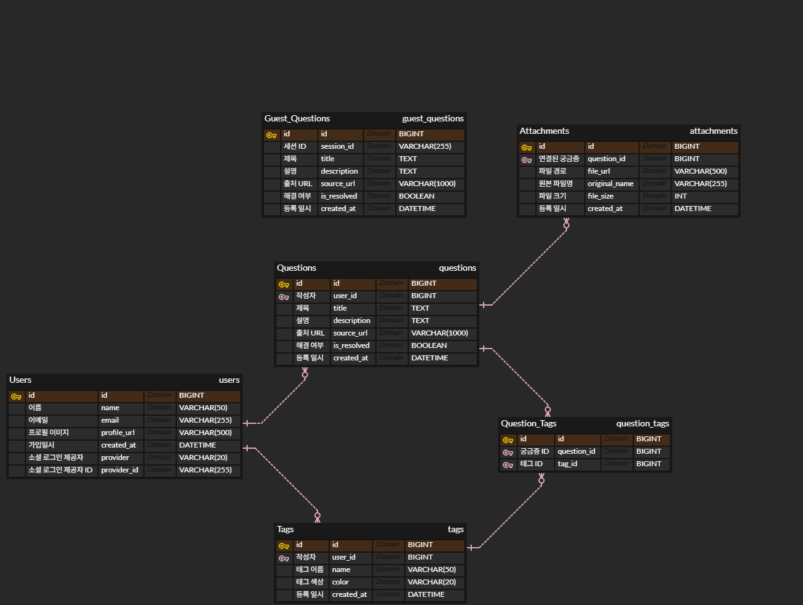

# Moya List 데이터베이스 설계

## ERD



## 테이블 정의서

### users (사용자)

| 컬럼 | 타입 | 제약조건 | 설명 |
|------|------|----------|------|
| id | BIGINT | PK, AUTO_INCREMENT | 사용자 고유 ID |
| name | VARCHAR(50) | NULL | 닉네임 |
| email | VARCHAR(255) | NOT NULL, UNIQUE | 이메일 (로그인 ID) |
| profile_url | VARCHAR(500) | NULL | 프로필 이미지 URL |
| provider | VARCHAR(20) | NULL | 소셜 로그인 제공자 (google, kakao 등) |
| provider_id | VARCHAR(255) | NULL | 소셜 로그인 제공자의 고유 ID |
| created_at | DATETIME | NOT NULL, DEFAULT CURRENT_TIMESTAMP | 가입일시 |

### questions (궁금증)

| 컬럼 | 타입 | 제약조건 | 설명 |
|------|------|----------|------|
| id | BIGINT | PK, AUTO_INCREMENT | 궁금증 고유 ID |
| user_id | BIGINT | FK → users.id, NOT NULL | 작성자 |
| title | VARCHAR(500) | NOT NULL | 궁금증 제목 |
| description | TEXT | NULL | 설명 (나중에 추가) |
| source_url | VARCHAR(1000) | NULL | 출처 URL (익스텐션에서 추가 시) |
| is_resolved | BOOLEAN | NOT NULL, DEFAULT FALSE | 해결 여부 |
| created_at | DATETIME | NOT NULL, DEFAULT CURRENT_TIMESTAMP | 등록일시 |

### tags (태그)

| 컬럼 | 타입 | 제약조건 | 설명 |
|------|------|----------|------|
| id | BIGINT | PK, AUTO_INCREMENT | 태그 고유 ID |
| user_id | BIGINT | FK → users.id, NOT NULL | 태그 소유자 |
| name | VARCHAR(50) | NOT NULL | 태그 이름 |
| color | VARCHAR(20) | NOT NULL, DEFAULT '#6B7280' | 태그 색상 (HEX) |
| created_at | DATETIME | NOT NULL, DEFAULT CURRENT_TIMESTAMP | 생성일시 |

**제약조건:** `(user_id, name)` UNIQUE — 같은 사용자가 같은 이름의 태그 중복 생성 불가

### attachments (첨부파일)

| 컬럼 | 타입 | 제약조건 | 설명 |
|------|------|----------|------|
| id | BIGINT | PK, AUTO_INCREMENT | 첨부파일 고유 ID |
| question_id | BIGINT | FK → questions.id, NOT NULL | 연결된 궁금증 |
| file_url | VARCHAR(500) | NOT NULL | 파일 저장 경로 (S3 URL) |
| original_name | VARCHAR(255) | NULL | 원본 파일명 |
| file_size | INT | NULL | 파일 크기 (bytes) |
| created_at | DATETIME | NOT NULL, DEFAULT CURRENT_TIMESTAMP | 등록일시 |

### question_tags (궁금증-태그 연결)

| 컬럼 | 타입 | 제약조건 | 설명 |
|------|------|----------|------|
| question_id | BIGINT | PK, FK → questions.id | 궁금증 ID |
| tag_id | BIGINT | PK, FK → tags.id | 태그 ID |

**복합 PK:** `(question_id, tag_id)` — 같은 궁금증에 같은 태그 중복 등록 불가

### guest_questions (게스트 궁금증)

| 컬럼 | 타입 | 제약조건 | 설명 |
|------|------|----------|------|
| id | BIGINT | PK, AUTO_INCREMENT | 게스트 궁금증 고유 ID |
| session_id | VARCHAR(255) | NOT NULL, INDEX | 브라우저 세션 ID |
| title | VARCHAR(500) | NOT NULL | 궁금증 제목 |
| source_url | VARCHAR(1000) | NULL | 출처 URL |
| created_at | DATETIME | NOT NULL, DEFAULT CURRENT_TIMESTAMP | 등록일시 |

**참고:** 게스트는 태그, 첨부파일, 해결 여부 기능 없음. 회원가입 시 questions 테이블로 이관 예정.

## 관계 요약

```
users (1) ─────< (N) questions
users (1) ─────< (N) tags
questions (1) ─────< (N) attachments
questions (N) ─────< (N) tags  [through question_tags]
```

## DDL

```sql
-- 테이블 생성
CREATE TABLE `users` (
	`id` BIGINT NOT NULL AUTO_INCREMENT,
	`name` VARCHAR(50) NULL,
	`email` VARCHAR(255) NOT NULL UNIQUE,
	`profile_url` VARCHAR(500) NULL,
	`provider` VARCHAR(20) NULL,
	`provider_id` VARCHAR(255) NULL,
	`created_at` DATETIME NOT NULL DEFAULT CURRENT_TIMESTAMP,
	PRIMARY KEY (`id`)
);

CREATE TABLE `questions` (
	`id` BIGINT NOT NULL AUTO_INCREMENT,
	`user_id` BIGINT NOT NULL,
	`title` VARCHAR(500) NOT NULL,
	`description` TEXT NULL,
	`source_url` VARCHAR(1000) NULL,
	`is_resolved` BOOLEAN NOT NULL DEFAULT FALSE,
	`created_at` DATETIME NOT NULL DEFAULT CURRENT_TIMESTAMP,
	PRIMARY KEY (`id`)
);

CREATE TABLE `tags` (
	`id` BIGINT NOT NULL AUTO_INCREMENT,
	`user_id` BIGINT NOT NULL,
	`name` VARCHAR(50) NOT NULL,
	`color` VARCHAR(20) NOT NULL DEFAULT '#6B7280',
	`created_at` DATETIME NOT NULL DEFAULT CURRENT_TIMESTAMP,
	PRIMARY KEY (`id`),
	UNIQUE KEY `UK_user_tag_name` (`user_id`, `name`)
);

CREATE TABLE `attachments` (
	`id` BIGINT NOT NULL AUTO_INCREMENT,
	`question_id` BIGINT NOT NULL,
	`file_url` VARCHAR(500) NOT NULL,
	`original_name` VARCHAR(255) NULL,
	`file_size` INT NULL,
	`created_at` DATETIME NOT NULL DEFAULT CURRENT_TIMESTAMP,
	PRIMARY KEY (`id`)
);

CREATE TABLE `question_tags` (
	`question_id` BIGINT NOT NULL,
	`tag_id` BIGINT NOT NULL,
	PRIMARY KEY (`question_id`, `tag_id`)
);

CREATE TABLE `guest_questions` (
	`id` BIGINT NOT NULL AUTO_INCREMENT,
	`session_id` VARCHAR(255) NOT NULL,
	`title` VARCHAR(500) NOT NULL,
	`source_url` VARCHAR(1000) NULL,
	`created_at` DATETIME NOT NULL DEFAULT CURRENT_TIMESTAMP,
	PRIMARY KEY (`id`),
	INDEX `IDX_session_id` (`session_id`)
);

-- 외래키 제약조건
ALTER TABLE `questions` 
	ADD CONSTRAINT `FK_questions_user` 
	FOREIGN KEY (`user_id`) REFERENCES `users` (`id`);

ALTER TABLE `tags` 
	ADD CONSTRAINT `FK_tags_user` 
	FOREIGN KEY (`user_id`) REFERENCES `users` (`id`);

ALTER TABLE `attachments` 
	ADD CONSTRAINT `FK_attachments_question` 
	FOREIGN KEY (`question_id`) REFERENCES `questions` (`id`);

ALTER TABLE `question_tags` 
	ADD CONSTRAINT `FK_question_tags_question` 
	FOREIGN KEY (`question_id`) REFERENCES `questions` (`id`);

ALTER TABLE `question_tags` 
	ADD CONSTRAINT `FK_question_tags_tag` 
	FOREIGN KEY (`tag_id`) REFERENCES `tags` (`id`);
```
